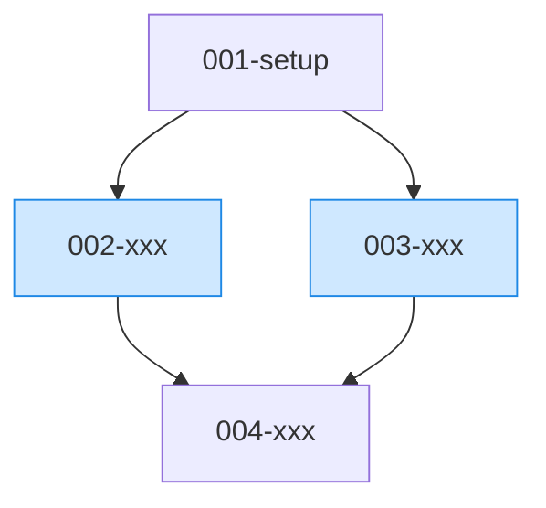

# タスクロードマップ: {プロジェクト名}

このドキュメントは `todos/` 配下のタスク群について、依存関係・並行実行可能性・推奨ワークロードをまとめた俯瞰ドキュメントです。各タスクの詳細は `todos/{連番}-{name}/README.md` を参照してください。

## タスク一覧

> 番号規約: 新規タスクは `0xx` 番台（`001`〜`099`）。`1xx` 番台は実行中（task-performer）に発生した追加・申し送りタスク用に予約。実行中に起票された 1xx タスクはこの表の末尾に追記する。

| ID | タスク名 | 概要 | 前提タスク | 並行グループ | 推定時間 | 並行実行推奨 |
| --- | --- | --- | --- | --- | --- | --- |
| 001-setup | 初期セットアップ | ... | - | - | 30m | - |
| 002-xxx | ... | ... | 001-setup | A | 1h | ✅ |
| 003-xxx | ... | ... | 001-setup | A | 1h | ✅ |
| 004-xxx | ... | ... | 002-xxx, 003-xxx | - | 2h | - |
| 101-xxx | （実行中追加）... | ... | 002-xxx | - | 1h | - |

## 依存DAG



> 凡例: 青塗りノード = 同じ並行グループ（同時実行可能）

## クリティカルパス

最長経路: `001-setup → 002-xxx → 004-xxx` (合計: **約3.5時間**)

このパス上のタスクが全体完了時間を決定する。最短化したい場合は、ここのタスクを優先的に実行・スリム化する。

## 並行実行可能なタスク群

### Group A
- 002-xxx
- 003-xxx
- **前提**: 001-setup 完了
- **非干渉性**: 編集対象ファイルが分離されている（具体的には `src/api/` と `src/ui/`）
- **推奨**: subagentで並列実行（後述「ステップ2」参照）

---

## 推奨ワークロード

最速完了のため、Claude Code の以下機能を組み合わせる。

### Step 1: 順次実行が必須なタスク

```
001-setup を task-performer で実行
```

完了を待ってから Step 2 へ。

### Step 2: 並行可能タスクを subagent で並列実行

1メッセージ内で複数の Agent ツール呼び出しを行うことで並列実行する。各タスクが同じファイルを編集する可能性がある場合は `isolation: worktree` を指定して隔離する。

```text
Group A の002-xxx と 003-xxx を以下の指示で並列実行:

Agent #1:
  subagent_type: general-purpose
  description: "002-xxx を実装"
  prompt: "todos/002-xxx/README.md の作業内容を完了させる。受け入れ条件をすべて満たすこと。"
  isolation: worktree   # 並行で他Agentと同じファイルを触る恐れがあるなら指定

Agent #2:
  subagent_type: general-purpose
  description: "003-xxx を実装"
  prompt: "todos/003-xxx/README.md の作業内容を完了させる。受け入れ条件をすべて満たすこと。"
  isolation: worktree
```

### Step 3: 統合タスクを実行

Group A の全Agent完了後、`004-xxx` を実行。両worktreeでの変更を統合する場合は事前にmergeまたはrebaseする。

### Step 4 (オプション): /goal で全体を自動完走させる

`/goal <条件>` は、指定条件が満たされるまで各ターン終了後に自動で次ターンを起動するコマンド。Step 1-3 の手動オーケストレーションを Claude 自身に委ねる選択肢として有効。

#### 完了条件の書き方ルール

`/goal` の評価モデルは独立した小型モデル（既定 Haiku）で、**Claude が会話に表示した出力のみ**で判定する。ファイル直接読取・コマンド実行は不可。そのため条件は以下を満たすこと:

- **会話上で実証可能な事実**で記述する（テスト/Lint コマンドの結果出力、TODO チェック状態など）
- **検証可能な単一条件**を AND で連結する。あいまいな主観表現は使わない
- 最大 4000 文字以内
- 可能なら `specs/` の「完了条件 / 成功の定義」セクションからそのまま引用する

#### コマンド例

```text
/goal todos/ 配下のすべての TODO の受け入れ条件チェックボックスが [x] になっており、`<プロジェクトのテストコマンド>` が exit 0 で成功し、`<lint コマンド>` の出力にエラーが 0 件であることが会話に表示されている
```

OK 例:
- 「`pytest` が `passed` を出力している」
- 「`npm run lint` が `0 problems` を出力している」
- 「`todos/004-xxx/README.md` の受け入れ条件がすべて [x]」

NG 例:
- 「ユーザーが満足する品質」（主観・実証不可）
- 「本番で安定稼働」（会話で実証不可）
- 「内部実装がきれい」（出力に現れない）

#### 使用上の制約

- 1 セッション 1 ゴール、`disableAllHooks` 環境では動作不可
- セッション再開時はターン数・トークンベースラインがリセットされる
- 達成判定は会話表示が根拠になるため、毎ターン末尾にテスト/Lint 結果を**会話に出力する**よう Claude へ指示しておくとよい

---

## ワークロード選択ガイド

| 状況 | 推奨アプローチ |
| --- | --- |
| 並行可能タスクが2-5個、ファイル独立 | **Subagents + worktree並列実行**（上記Step 2） |
| 5-30個の機械的に類似した変更 | `/batch` でworktree-isolated subagentに自動分散 |
| バックグラウンド長時間実行を複数走らせたい | `claude agents` (Agent View) で各タスクをバックグラウンドセッション化 |
| すべて完走させて結果だけ確認したい | `/goal` + auto mode で全自動 |
| タスク数が少なく依存が直線的 | `task-performer` で順次実行 |
| 完了通知が欲しい | Stop hook でデスクトップ通知 / Slack 通知 |

---

## 進捗管理

- 各タスク完了時に該当 `todos/{ID}/README.md` の受け入れ条件にチェックを入れる
- 全タスク完了時にこの README.md 末尾の「完了宣言」にサインオフ

## 完了宣言

- [ ] すべての TODO が完了
- [ ] 受け入れ条件すべて達成
- [ ] テスト/lint パス
- [ ] レビュー承認済み
