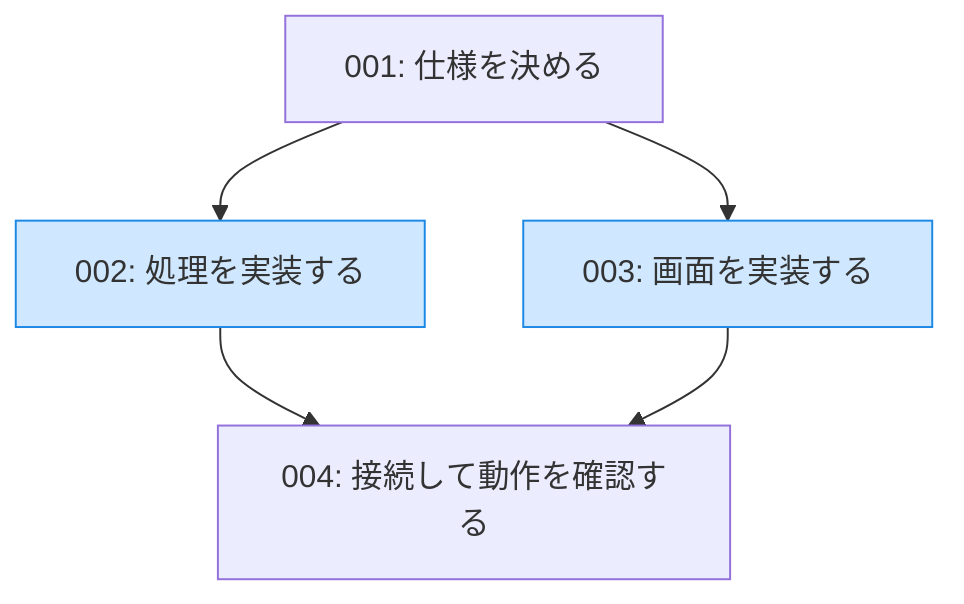

# タスクロードマップ: {プロジェクト名}

目的と完成後の姿は[全体説明](../README.md)、現在の状態は[進捗一覧](../progresses/README.md)を参照する。この文書では、着手する順序と待つ必要がある作業を説明する。

## タスク一覧

<!-- 新規は001〜099。101〜199は実行中の追加用に予約し、初期計画の表には含めない。各タスク名はREADMEへリンクする -->

| ID | 作業名・得られる成果 | 前提タスク | 並行グループ | 推定時間 | 並行実行推奨 |
| --- | --- | --- | --- | --- | --- |
| {ID} | {作業名と完了時に使えるもの} | {IDと作業名、またはなし} | {グループ名、またはなし} | {時間} | {可否} |

## 作業の依存関係

<!-- 前提作業を矢印で結ぶ図をMermaidで生成する。ノードはIDだけでなく作業名を含める。並行グループは色と凡例で示す -->

```mermaid
graph TD
  A["001: 仕様を決める"] --> B["002: 処理を実装する"]
  A --> C["003: 画面を実装する"]
  B --> D["004: 接続して動作を確認する"]
  C --> D
  classDef parallel fill:#cfe8ff,stroke:#1e88e5;
  class B,C parallel;
```

<!-- 上の例を実際のタスクへ置換する。青は同時に進められる作業 -->

## 完了までの見通し

<!-- 遅れると全体の完了も遅れる作業の経路を、ID・作業名・合計時間で示す -->

- **全タスクの作業時間の合計**: {時間}
- **並行実行した場合の最長経路と所要時間**: {経路と時間}
- **作業時間に含まない待ち時間**: {レビュー、外部作業、運用観測等。なければ省略}

## 並行できる作業

<!-- グループごとに前提と、同時に進めても競合しない理由を書く -->

- **グループ名**: {同時に行う作業が分かる名前}
- **対象**: {IDと作業名}
- **着手条件**: {必要な先行作業と成果物}
- **同時に進めても衝突しない理由**: {編集ファイルと共有状態の分担}
- **統合方法**: {作業場所を分ける場合、いつ誰が変更を合わせるか}

## 作業の進め方（実行順と待ち条件）

<!-- 全体の背景を繰り返さず、各順序の前提と受け渡す成果を示す。並行できる作業がなければ直列の手順だけを書く -->

1. {最初に行う作業と、その成果}
2. {先行作業の何を確認したら、どの作業へ進めるか}
3. {変更を統合し、期待する結果を確認する作業}

## 完了の判断と進捗

<!-- プロジェクトの完了条件の要点と、定義元の specs/ へのリンクを記載する -->

作業状態と受け入れ条件の検証結果は、各タスクの `progresses/{ID}/PROGRESS.md` に記録する。TODOの本文には進捗を書き込まない。

## 付録: AIへの実行指示（必要な場合のみ）

<!--
採用する実行手段の指示だけを書く。必要がなければ節ごと削除する。
- 順次実行: task-performer に渡すTODOのパスと完了条件
- 並行実行: 各担当のTODO・編集範囲・前提・統合手順
- /goal等: specsの成功条件から自動確認できる範囲を取り出し、確認の記録と人の判断を待つ条件を示す
利用環境で確認していないコマンドを載せず、ツールの一般的な解説を繰り返さない。
-->
